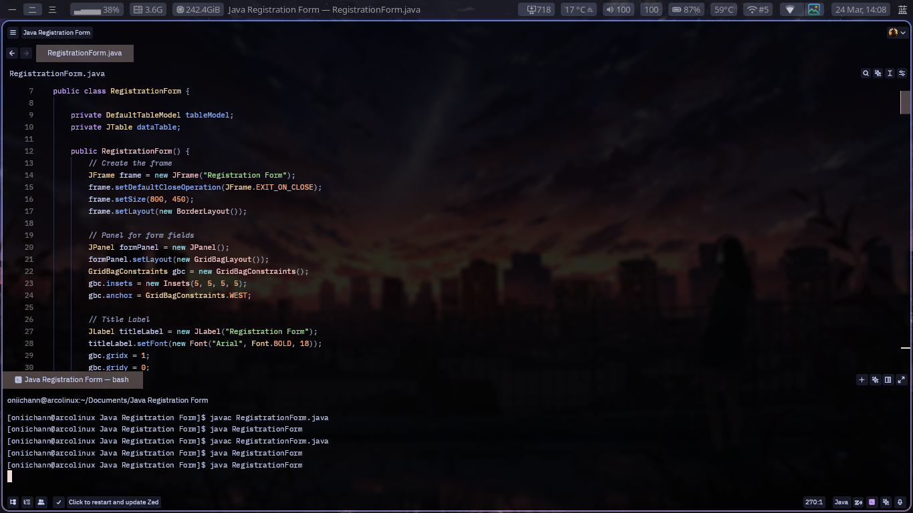
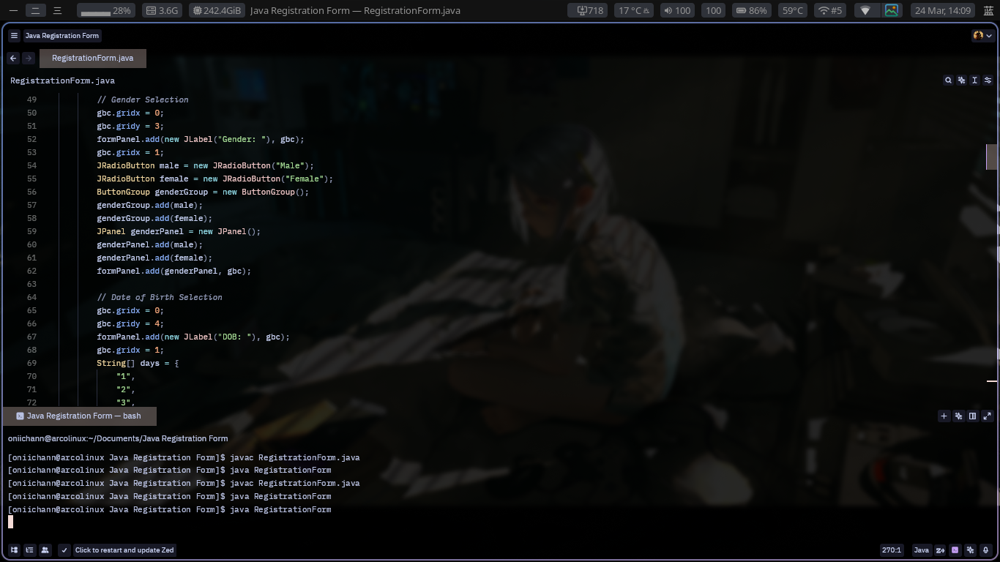
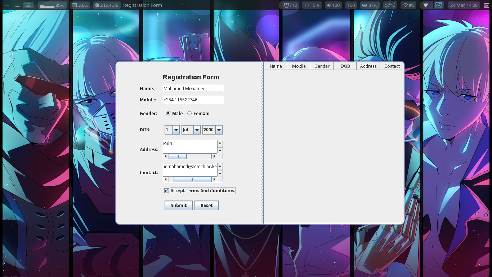
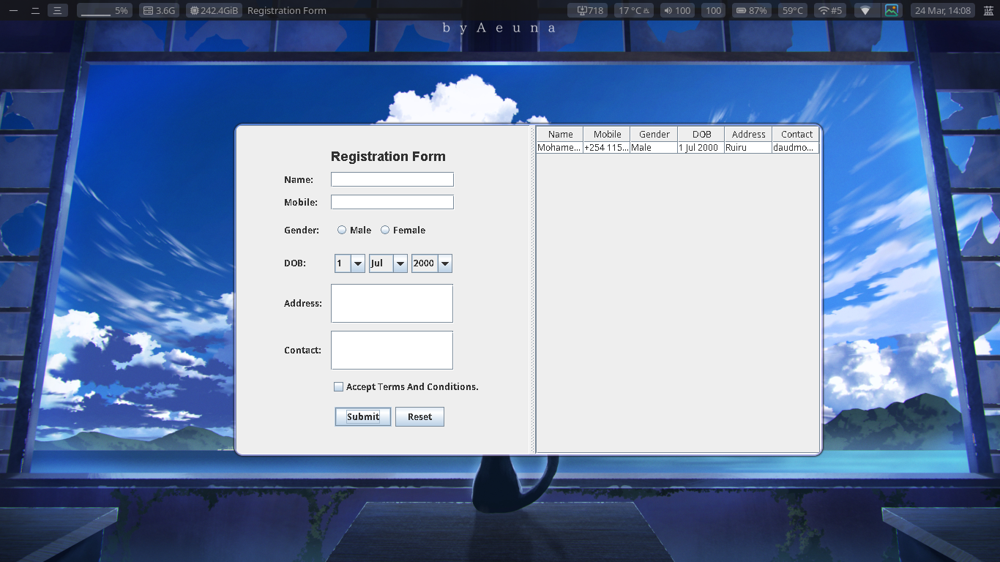

# Java Registration Form

## Description
### MOHAMED DAUD MOHAMED
### BSE-01-0009/2025
### 24/3/2025

## 📸 Screenshots
### 🖥️ Code Editor:

### 📝 Running Application:

### Instructions to run the program:
1. Clone the repository.
2. Navigate to the project directory.
3. Compile the program using the command `javac RegistrationForm.java`.
4. Run the application using the command `java RegistrationForm`.
